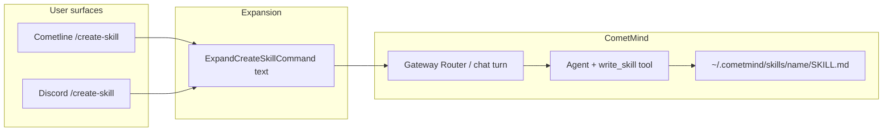

# Slash commands: Cometline composer + Discord gateway

**Date:** 2026-06-16  
**Components:** `cometline/src/lib/skills/slash-commands.ts`, `Composer.svelte`, `cometmind/internal/gateway/discord/adapter.go`, `cometmind/internal/skills/`, `cometmind/server/server.go`, `cometmind/internal/tools/write_skill.go`, `cometmind/dist/cometmind`

## What we built

A **dual-surface slash command model**:

| Surface | Mechanism | Example |
| ------- | --------- | ------- |
| **Cometline composer** | User types `/name` in chat; text is expanded before the agent turn | `/create-skill`, `/commit-conventions` |
| **Discord** | Discord Application Commands registered on the bot; interaction routes into the same gateway agent turn | `/thread`, `/create-skill` |

Skill discovery slash commands (`/skill-name`) are **dynamic** — any discovered skill becomes a composer command automatically. **Builtin** commands (like `create-skill`) are fixed in code and must be added explicitly on both surfaces if you want parity.

Related skills lifecycle work in the same change:

- `write_skill` tool → writes to `~/.cometmind/skills/{name}/SKILL.md`
- Settings panel **Export** / **Delete** (symlink / external skills: export OK, delete disabled)
- HTTP: `GET /skills/{name}/export`, `DELETE /skills/{name}`

---

## Mindset: adding a new slash command

### 1. Decide what “slash” means on each surface

**Cometline** does not use Discord’s command registry. It is **plain text** until submit:

1. User types `/foo` → autocomplete menu (builtins + discovered skills).
2. On send, `expandBuiltinSlashCommand()` or `expandSkillCommand()` rewrites text into agent instructions.
3. The agent turn runs with the expanded prompt (and tools).

**Discord** uses **Application Commands** (the `/` menu in Discord itself):

1. Register command definitions with Discord API (`ApplicationCommandBulkOverwrite`).
2. Handle `InteractionApplicationCommand` in `onInteractionCreate`.
3. Route into `gateway.InboundMessage` → `Router.HandleInbound` (same runtime as chat messages).

If you add a command on only one surface, users on the other will not see it.

### 2. Cometline checklist

| Step | File | Action |
| ---- | ---- | ------ |
| Define builtin | `src/lib/skills/slash-commands.ts` | Add to `BUILTIN_SLASH_COMMANDS`; implement or reuse `expand…()` text |
| Autocomplete | `Composer.svelte` | Already merges builtins via `filterSlashMenuOptions()` — no change unless UX differs |
| Submit expansion | `Composer.svelte` | `expandBuiltinSlashCommand()` runs before `expandSkillCommand()` in `submit()` |
| Chips | `RichComposerInput.svelte` | Do **not** add builtin names to `skillNames` unless you want skill chips |
| Agent capability | `cometmind/internal/tools/` | Add a tool if the command needs side effects outside workspace (e.g. `write_skill` for `~/.cometmind/skills`) |

Shared expansion text for Discord and Cometline should stay **semantically aligned**. Today:

- Go: `skills.ExpandCreateSkillCommand()` in `internal/skills/create_prompt.go`
- TS: `expandCreateSkillCommand()` in `slash-commands.ts`

Keep them in sync when you change the workflow.

### 3. Discord checklist

| Step | File | Action |
| ---- | ---- | ------ |
| Register command | `internal/gateway/discord/adapter.go` | Add entry to `applicationCommands()` |
| Handle interaction | `adapter.go` | Add `case` in `onInteractionCreate` → dedicated handler |
| Route to agent | Handler | Build `gateway.InboundMessage` with `Mentioned: true` if `require_mention` would block normal messages |
| Ephemeral ack | Handler | `InteractionRespond` with ephemeral text so Discord does not hang waiting |
| Rebuild binary | `cometmind/dist/cometmind` | Electron spawns `../cometmind/dist/cometmind` in dev — **must rebuild after Go changes** |
| Restart gateway | Cometline Settings | Toggle Discord gateway off/on, or restart the app |

### 4. Skills that need filesystem writes

`write_file` is **workspace-scoped**. Commands that create global skills must use a dedicated tool (`write_skill`) or a CometMind API — not `write_file` to an absolute path.

Managed skills live under `~/.cometmind/skills/`. Capabilities:

- `can_delete`: only a **real directory** at `~/.cometmind/skills/{name}` (not symlink)
- `can_export`: generally all discovered skills (zip resolves symlink targets)
- `is_symlink`: mirror entry or path is symlink → show badge, disable delete in UI

---

## Symptom: Discord only showed `/thread`, not `/create-skill`

After implementing `/create-skill` in code, Discord’s slash menu still listed only `/thread` (sometimes duplicated under “經常使用”).

## Root causes

### 1. Stale `cometmind` binary

Cometline’s Electron main process spawns the gateway from:

```text
cometmind/dist/cometmind   # dev
```

Editing Go source does **not** update the running bot until you rebuild:

```bash
cd cometmind && go build -o dist/cometmind .
```

Then restart the Discord gateway (or restart Cometline).

### 2. Slash commands registered before the Discord session was ready

Initial implementation called `registerCommands()` immediately after `Session.Open()`. At that moment `Session.State.User` (or application ID) is often **not** populated yet. Registration failed with a logged error; Discord kept the **previous** global command set (only `/thread`).

```go
// Before (fragile)
if err := a.Session.Open(); err != nil { return err }
if err := a.registerCommands(); err != nil {
    log.Printf("discord: slash command registration failed: %v", err)
}
```

Failures were silent from the user’s perspective — only `/thread` remained visible.

## Fix

### Register on `Ready`, not right after `Open`

```go
a.Session.AddHandler(func(s *discordgo.Session, r *discordgo.Ready) {
    if err := a.registerCommands(s, r); err != nil {
        log.Printf("discord: slash command registration failed: %v", err)
    } else {
        log.Printf("discord: slash commands registered (thread, create-skill)")
    }
})
```

`registerCommands` uses `ready.Application.ID` (fallback: `State.User.ID`) and `ApplicationCommandBulkOverwrite` to replace the full global command list.

### Rebuild and restart

```bash
cd cometmind && go build -o dist/cometmind .
```

Restart Cometline / toggle Discord gateway. Confirm in log:

```bash
tail -20 ~/.cometmind/cometline.log
# expect: discord: slash commands registered (thread, create-skill)
```

Discord may cache slash commands for a short time; wait 1–2 minutes or restart the Discord client if needed.

---

## Reference: `create-skill` end-to-end flow



---

## How to avoid regressions

- **Rebuild `dist/cometmind`** after any change to `internal/gateway/discord/` or slash-command behavior. `make dev` does not auto-rebuild Go.
- **Register Discord commands on `Ready`**, not synchronously after `Open()`. Reconnects will re-register — that is fine.
- **Use `ApplicationCommandBulkOverwrite`** with the **full** desired command list. Omitted commands are removed from Discord globally.
- **Keep Cometline and Discord expansion text aligned** when changing what a builtin command does.
- **Do not pass reactive Svelte proxies over IPC** (see [fetch-models-data-clone-error.md](./fetch-models-data-clone-error.md)); slash commands do not use IPC for expansion, but settings/skills UI does use HTTP to CometMind.
- **Symlink skills**: never enable delete in UI/API for mirror symlinks; users sync external skills with “Sync symlinks”, not delete.
- When adding a new **managed** skill API, extend `SkillCapabilities` / `skillResource` and OpenAPI together.

## Verification

### Cometline composer

1. Type `/` → `create-skill` appears at top of menu (builtins before skills).
2. Send `/create-skill help me with X` → agent receives expanded prompt mentioning `write_skill`.
3. After agent writes skill, Settings → CometMind → Skills lists it; Export downloads zip; Delete works for local dirs, disabled for symlinks.

### Discord

1. Rebuild: `cd cometmind && go build -o dist/cometmind .`
2. Restart gateway; log shows `slash commands registered (thread, create-skill)`.
3. In server channel: `/create-skill` and `/thread` both appear for the bot.
4. `/create-skill request:…` triggers agent reply in channel/thread (with allowlist / mention rules bypassed via `Mentioned: true` on the synthetic inbound message).

### Tests

```bash
cd cometmind && go test ./internal/skills ./internal/gateway/discord ./server ./internal/tools
```
